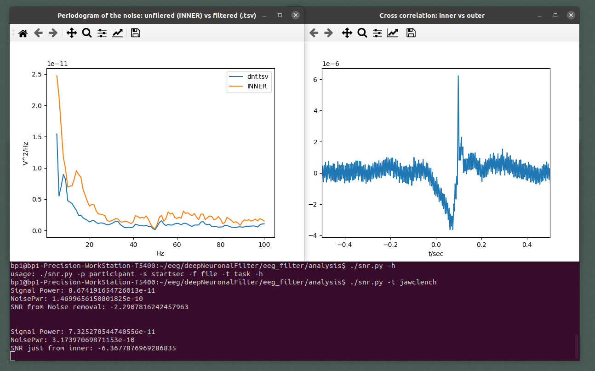

# Data analysis tools

## Pre-requisites

The following python modules are required:
 - matplotlib
 - numpy
 - plotly
 - scipy

To plot the weights please install `gnuplot`.

## Commandline parameters

All python commandline tools have the same parameters:
 - -p participant number between 1 and 20 (default 1)
 - -s The second at which the data analysis starts (default 120sec for p300 and 60sec for jawclench)
 - -t The task which is either "p300" (default) or "jawclench"
 - -f The filter output file used. That can be either "dnf.tsv" (default) or "lms.tsv"
 - -h Help

All parameters are optional and have default values set.

## explore.py

Displays a timedomain and frequency domain plot either in
matplotlib or in the browser.
```
./explore.py -p participant -s startsec -e endsec -f noiseredfile.tsv -t task -m -h
```
 - Option -m switches over to matplotlib. Default is plotly.
 - Option -e is the second where the plot ends in the timedomain.

## p300.py
Plots the p300 of a subject.
```
./p300.py -p participant -s startsec -f file -h
```

## snr.py



Calculates the SNR of one subject
```
./p300.py -p participant -s startsec -f file -h
```

## SNRcompareDNFLMS.py
Compares DNF SNR increase against LMS SNR increase for jawclench.
```
./SNRcompareDNFLMS.py
```

## plot_weights_subject10_jawclench.plt
Gnuplot script which plots the weights of the individual layers during jawclench of subject 10.
```
gnuplot plot_weights_subject10_jawclench.plt
```
which generates `gnuplot plot_weights_subject10_jawclench.eps`.
